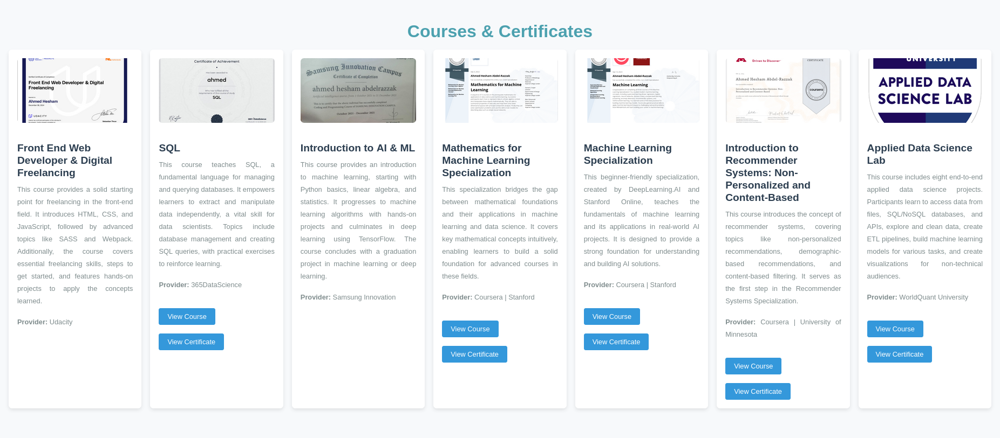
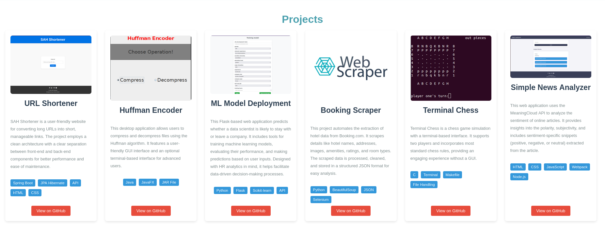

# Portfolio Website  

Welcome to my portfolio website repository! This project showcases my skills, projects, and certifications in web development, machine learning, and data science. The website is built to serve as a dynamic resume, providing a detailed overview of my work and achievements.  

## 🖥️ Live Demo  
Check out the live website here: [Your Portfolio Link](#).  

---

## 🛠️ Features  
- **Courses & Certificates**: Displays a collection of completed courses and certifications with descriptions and links to view the certificates.  
- **Projects**: Highlights major projects with detailed descriptions, tech stacks, and GitHub links for each.  
- **Responsive Design**: Fully responsive for a seamless experience on all devices.  

---

## 📂 Project Structure  
```plaintext
├── index.html          # Main HTML file for the website
├── style.css           # Stylesheet for website styling
├── scripts.js          # JavaScript for dynamic functionality
├── static/             # Static assets (images, icons, etc.)
│   ├── imgs/
│   │   ├── certificates_badges/  # Images for certificates
│   │   ├── projects/             # Screenshots of projects
│   └── ...
└── README.md           # Project documentation (this file)
```

---

## 🚀 Getting Started  

### Prerequisites  
- Basic knowledge of HTML, CSS, and JavaScript.  
- [Node.js](https://nodejs.org/) installed for additional development tools (optional).  

### Installation  
1. Clone the repository:  
   ```bash
   git clone https://github.com/YourUsername/portfolio.git
   ```  
2. Navigate to the project directory:  
   ```bash
   cd portfolio  
   ```  
3. Open `index.html` in your browser to view the portfolio.  

### Optional: Start a Local Server  
To run the website on a local server:  
1. Install the `http-server` package globally:  
   ```bash
   npm install -g http-server  
   ```  
2. Start the server:  
   ```bash
   http-server  
   ```  
3. Open the provided local URL in your browser.  

---

## 📜 Sections  

### 1. **Courses & Certificates**  
A collection of my completed courses and certifications with brief descriptions, key takeaways, and links to the certificates.  

### 2. **Projects**  
A detailed portfolio of my major projects with:  
- High-quality screenshots.  
- Tech stack used.  
- GitHub repository links for further exploration.  

---

## 🛠️ Tech Stack  
The portfolio is built using:  
- **HTML**: Structuring the web pages.  
- **CSS**: Styling and responsive design.  
- **JavaScript**: Adding interactivity and functionality.  

---

## 📸 Screenshots  
### Homepage  
  

### Courses Section  
  

### Projects Section  
  

---

## 🤝 Contributing  
Contributions, issues, and feature requests are welcome!  
1. Fork the repository.  
2. Create your feature branch:  
   ```bash
   git checkout -b feature/YourFeatureName  
   ```  
3. Commit your changes:  
   ```bash
   git commit -m 'Add some feature'  
   ```  
4. Push to the branch:  
   ```bash
   git push origin feature/YourFeatureName  
   ```  
5. Open a pull request.  

---

## 🔗 Links  
- **Live Website**: [Portfolio Website](#)  
- **GitHub Profile**: [Your GitHub Username](https://github.com/YourUsername)  

---

## 📝 License  
This project is licensed under the [MIT License](LICENSE).  
Feel free to use, modify, and distribute this project as per the terms of the license.  

---

## 🙏 Acknowledgments  
- [MeaningCloud API](https://www.meaningcloud.com/) for sentiment analysis.  
- [BeautifulSoup](https://www.crummy.com/software/BeautifulSoup/) and [Selenium](https://selenium.dev/) for web scraping support.  
- [Coursera](https://www.coursera.org/) and [Udacity](https://www.udacity.com/) for providing great learning resources.  
